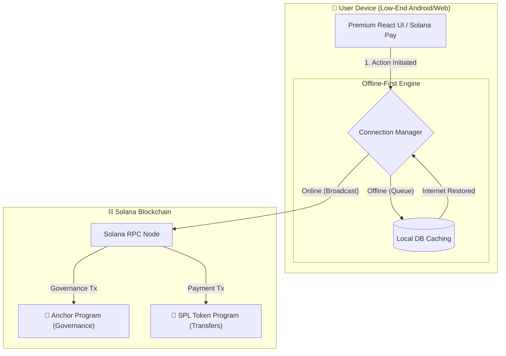

# 🌍 SolanaVoice 

> **Decentralized governance and P2P payments for offline-first communities in emerging markets.**

**[🔗 View the Live Demo Here](https://solana-voice-demo.vercel.app/)** *(Replace with your actual Vercel link)*

SolanaVoice is a lightweight, open-source platform designed for cooperatives, local DAOs, and savings groups. It allows communities to hold on-chain votes, coordinate local decisions, and send peer-to-peer payments via Solana Pay, featuring a premium, high-contrast "Cultural Tech" user interface.

---

## 🚨 The Problem

In emerging markets, local community groups form the backbone of financial and social coordination. However, they face massive hurdles:
* **Financial Exclusion:** Traditional banking infrastructure is often inaccessible or expensive.
* **Lack of Transparency:** Local savings groups often rely on physical ledgers or pure trust, leading to disputes.
* **Web3's Infrastructural Disconnect:** Most dApps are built for users with high-end devices and constant 5G connections. They fail in environments where low-end Android devices and intermittent internet are the norm.

## 💡 The Solution

SolanaVoice bridges this gap by combining the extreme low fees and high throughput of the Solana blockchain with an **offline-first, mobile-optimized architecture**. 

* **Lightweight Governance:** Communities can propose and vote on initiatives (e.g., "Allocate 50 USDC for community well repairs"). 
* **Seamless Payments:** Integrated Solana Pay allows for instant P2P treasury distributions via scannable QR codes—no complex wallet interactions required.
* **Built for Reality:** Designed to queue transactions and votes locally when offline, broadcasting them to the network the moment connectivity is restored.

---

## 🏗️ Architecture & Flow

    class UserDevice device;
    class OfflineLayer offlinestorage;
    class Solana blockchain;
